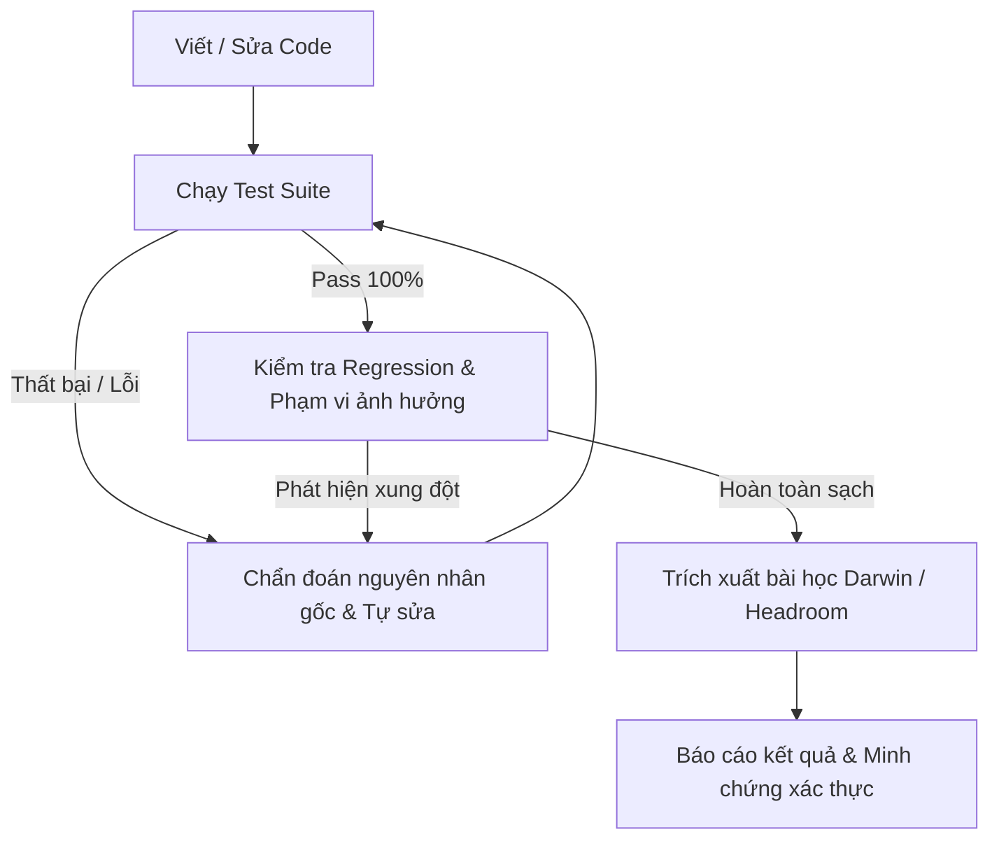

# CookieGli Agent Operating Guidelines & Genome Integration

Chào mừng các Agent đến với dự án. Dự án này được vận hành theo tiêu chuẩn **CookieGli Core Architecture** kết hợp với **Headroom Context Economy** và **System Autopilot Continuous Loop**.

---

## 1. Project Context Onboarding (Genome First)
- **Luôn nạp Genome trước**: Khi bắt đầu một phiên làm việc hoặc tiếp nhận task mới, hãy đọc file [`.agents/GENOME.md`](file:///E:/AI/Glimax/CookieGli/.agents/GENOME.md) để nắm toàn bộ bức tranh kiến trúc dự án (Architecture DNA, Dependency Matrix, API Registry, Pattern Standards, Hotspots) chỉ trong < 600 tokens.
- **Không quét mù toàn bộ thư mục**: Tuyệt đối không đọc toàn bộ codebase bằng các lệnh liệt kê tốn token. Sử dụng `grep_search` và `view_file` có line range (`StartLine`/`EndLine`) dựa trên thông tin định vị từ `GENOME.md`.
- **Cập nhật Genome sau thay đổi lớn**: Nếu vừa hoàn thành một đợt tái cấu trúc (refactor) lớn hoặc thêm nhiều file/class mới, hãy chạy:
  ```powershell
  python cli/cookiegli.py genome build . --save .agents/GENOME.md
  ```

---

## 2. Headroom Token Economy & Context Discipline
- **Deduplicate Reads**: Không đọc lại file đã đọc trong cùng một turn.
- **Mental AST Compression**: Khi đọc code, chỉ giữ lại cấu trúc classes, function signatures, logic rẽ nhánh; bỏ qua import boilerplate và comment thừa trong context làm việc.
- **Log Noise Stripping**: Khi chạy test hoặc build, chỉ trích xuất các dòng cảnh báo/lỗi cụ thể để phân tích; không in toàn bộ danh sách build pass.

---

## 3. The Continuous Engineering Loop (System Autopilot)
Mỗi khi viết hoặc sửa đổi code, Agent **bắt buộc** thực hiện chu trình khép kín sau:



### Quy chuẩn kiểm thử (Zero Defect Delivery):
```powershell
python -m unittest discover -s tests -v
```
Tất cả các unit test phải vượt qua 100% trước khi kết thúc task.

---

## 4. Darwin Knowledge Evolution (Learned Patterns)
Khi Agent giải quyết được một bug khó hoặc tìm ra một giải pháp tối ưu từ thất bại, hãy ghi nhận bài học kinh nghiệm để tích lũy tri thức cho các Agent ở các phiên tiếp theo:

<!-- darwin:learnings:start -->
### 🧬 Darwin Learned Patterns & Best Practices
- [LESSON] **Windows Shell Safety** (ROI: 1.00, SR: 100%): Tuyệt đối không gọi các lệnh Unix shell ngoài (`date -u`, `2>/dev/null`, `grep | head`) qua `os.popen()` hoặc `subprocess` trên Windows vì sẽ gây treo tiến trình (hang). Sử dụng pure Python stdlib (`datetime`, `pathlib`, `ast`).
- [PATTERN] **Bayesian Smoothed ROI** (ROI: 0.96, SR: 100%): Sử dụng Laplace smoothing (success + 1)/(total + 2) để tránh việc biến dạng điểm ROI khi số lượt dùng còn quá ít.
- [PATTERN] **Capacity Pruning Algorithm** (ROI: 0.95, SR: 100%): Khi cắt tỉa pool `max_artifacts`, phải ưu tiên bảo vệ `protect_recent` nhưng vẫn đảm bảo tổng số item active không vượt quá `max_artifacts` bằng cách tỉa item có ROI thấp nhất trong nhóm non-protected trước.
- [PATTERN] **Atomic File Persistence** (ROI: 0.94, SR: 100%): Ghi dữ liệu vào file tạm cùng thư mục rồi `os.replace` để bảo đảm file JSON state không bao giờ bị hỏng giữa chừng.
<!-- darwin:learnings:end -->
