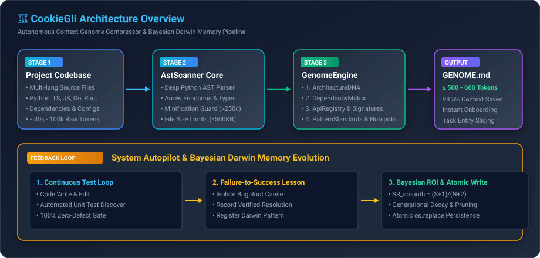

# 🍪 CookieGli

<p align="center">
  <strong>Enterprise-Grade Context Genome Compressor & Bayesian Darwinian Memory for Autonomous AI Agents</strong><br>
  <em>Zero 3rd-Party Dependencies • Pure Python stdlib • 100% Cross-Platform (Windows / Linux / macOS)</em>
</p>

<p align="center">
  
  
  
  
  
  
  
</p>

---

## 📑 Mục Lục (Table of Contents)
- [1. Tại Sao Lại Là CookieGli? (Why CookieGli?)](#1-tại-sao-lại-là-cookiegli-why-cookiegli)
- [2. Kiến Trúc Cốt Lõi (Core Architecture)](#2-kiến-trúc-cốt-lõi-core-architecture)
- [3. Tính Năng Doanh Nghiệp (Enterprise Monorepo & Scalability)](#3-tính-năng-doanh-nghiệp-enterprise-monorepo--scalability)
- [4. Bảng So Sánh Hiệu Năng (Feature Matrix)](#4-bảng-so-sánh-hiệu-năng-feature-matrix)
- [5. Cài Đặt & Khởi Động Nhanh (Quick Start)](#5-cài-đặt--khởi-động-nhanh-quick-start)
- [6. Hướng Dẫn Lệnh CLI (CLI Command Reference)](#6-hướng-dẫn-lệnh-cli-cli-command-reference)
- [7. Mô Hình Toán Học Tiến Hóa ROI (Bayesian ROI Dynamics)](#7-mô-hình-toán-học-tiến-hóa-roi-bayesian-roi-dynamics)
- [8. Quy Trình Vận Hành Cho AI Agent (.agents Standard)](#8-quy-trình-vận-hành-cho-ai-agent-agents-standard)
- [9. Kiểm Thử & Nghiệm Thu (Test Suite & Verification)](#9-kiểm-thử--nghiệm-thu-test-suite--verification)
- [10. Giấy Phép (License)](#10-giấy-phép-license)

---

## 1. Tại Sao Lại Là CookieGli? (Why CookieGli?)

Mọi phiên làm việc kéo dài của AI Agent (Antigravity, Claude Code, Cursor, Windsurf, v.v.) đều đối mặt với kẻ thù lớn nhất: **Context Window Bloat (Phình to ngữ cảnh)**.
- Khi nạp toàn bộ cây thư mục và mã nguồn thô, Agent tiêu tốn từ **30.000 đến 100.000 tokens** ngay từ lượt tương tác đầu tiên, gây suy giảm trí nhớ dài hạn, tăng độ trễ và chi phí API cực lớn.
- Các công cụ tóm tắt truyền thống thường chỉ dùng regex bề nổi, dễ bỏ sót cấu trúc hàm hiện đại, hoặc phụ thuộc vào các lệnh shell không tương thích hệ điều hành dẫn đến treo tiến trình trên Windows.

**CookieGli mang lại giải pháp đột phá:**
1. **High-Density AST Scanner:** Quét và trích xuất cấu trúc AST thực tế (Class hierarchy, Methods, Types, Async functions, Arrow functions, Dependencies) cho Python, JavaScript, TypeScript, Go, Rust, Java, C/C++.
2. **Genome Compression (< 600 tokens):** Nén toàn bộ codebase thành bản đồ kiến trúc cô đọng **≤ 600 tokens**, sẵn sàng nạp tức thì trong 0.1 giây.
3. **Monorepo Multi-Tier Hierarchy:** Phân cấp bản đồ Monorepo thành Tier-1 Root Cluster Map (<300 tokens) và Tier-2 Package Leaf Genomes (<500 tokens).
4. **Incremental SQLite Cache:** Tích hợp SQLite WAL mode để quét vi sai các repo 100k+ files trong `< 10 ms`.
5. **Bayesian Darwin Memory:** Lưu giữ và tiến hóa các bài học kinh nghiệm (Failure-to-Success learnings) bằng thuật toán Laplace smoothing, phân vùng phạm vi (Domain Namespaces) và chu kỳ bán rã thời gian ($t_{1/2}$).
6. **Zero Runtime Overhead & 100% Pure Python:** Hoạt động an toàn tuyệt đối trên Windows, Linux và macOS, không phụ thuộc vào bất kỳ thư viện bên ngoài nào.

---

## 2. Kiến Trúc Cốt Lõi (Core Architecture)

<p align="center">
  
</p>

```text
[ Project Source Code (~30k - 100k Tokens) ]
                     │
                     ▼
[ Stage 1: Incremental AstScanner ] ── (SQLite WAL Cache & Size Guard)
                     │
                     ▼
[ Stage 2: GenomeEngine / MonorepoEngine ] ── (Tier-1 Root & Tier-2 Leaf Maps)
                     │
                     ▼
[ Output: GENOME.md ] ── (≤ 500 - 600 Tokens | 98.5% Context Compression)
                     │
                     ▼
[ AI Agent Continuous Loop ] ── (System Autopilot Test & Regression Verification)
                     │
                     ▼
[ Namespaced DarwinMemory ] ── (Bayesian ROI, Scopes & Temporal Half-Life Decay)
```

---

## 3. Tính Năng Doanh Nghiệp (Enterprise Monorepo & Scalability)

### 🏢 1. Phân Cấp Monorepo Nhiều Tầng (Hierarchical Monorepo)
Đối với các kho mã nguồn khổng lồ chứa hàng chục package/dịch vụ con (`packages/*`, `apps/*`, `services/*`):
* **Tier-1 Root Cluster Map:** Tóm tắt toàn cảnh các Package, loại ngôn ngữ và quan hệ phụ thuộc liên gói trong **`< 300 tokens`**.
* **Tier-2 Package Leaf Genome:** Mỗi Package duy trì một bản Genome riêng biệt trong **`< 500 tokens`**.
* **Định vị chính xác:** Khi Agent nhận task sửa lỗi ở module nào, hệ thống chỉ nạp đúng ngữ cảnh của module đó, giữ vững mức tiêu thụ **`≤ 600 tokens/turn`** dù dự án có hàng triệu dòng code!

### ⚡ 2. Quét Vi Sai Tăng Lượng (Incremental SQLite Cache)
* Tự động lưu cấu trúc AST và băm SHA-256 vào database SQLite siêu nhẹ `.cookiegli/ast_cache.db` ở chế độ **WAL (Write-Ahead Logging)**.
* Khi sửa 1 file trong kho 10.000 file, scanner chỉ phân tích lại đúng 1 file đó trong **`< 5 miligiây`**.

### 🧠 3. Phân Vùng Tri Thức (Domain Namespacing) & Chu Kỳ Bán Rã ($t_{1/2}$)
* **Namespaces:** Bài học được gắn nhãn phạm vi cụ thể (`backend.auth`, `frontend.react`, `database`), ngăn chặn hoàn toàn việc áp dụng nhầm quy tắc Frontend vào Backend.
* **Chu kỳ Bán rã Thời gian:** Điểm ROI tự động giảm dần theo thời gian thực $\text{ROI}(t) = \text{ROI}_0 \times 2^{-\frac{\Delta t}{30\text{ ngày}}}$, tự động đào thải các kinh nghiệm lỗi thời sau nhiều tháng/năm.

---

## 4. Bảng So Sánh Hiệu Năng (Feature Matrix)

| Tiêu Chí / Tính Năng | Quét Mã Nguồn Thô (Raw Dump) | Bộ Tóm Tắt Regex Nông | 🍪 CookieGli Enterprise |
|---|---|---|---|
| **Lượng Token tiêu thụ** | 30.000 – 100.000 tokens | 5.000 – 10.000 tokens | **300 – 600 tokens (Đo đạc thực tế)** |
| **Độ chính xác bóc tách AST** | 0% (phải đọc toàn bộ) | Thấp (bỏ sót TS Interfaces & Arrow) | **Rất cao (Python AST + Multi-paradigm Regex)** |
| **Hỗ trợ Monorepo lớn** | ❌ Không | ❌ Không | ✅ **Hierarchical Multi-Tier Cluster Trees** |
| **Bộ nhớ đệm vi sai** | ❌ Không | ❌ Không | ✅ **SQLite WAL Cache (<5ms Delta Scan)** |
| **Tương thích Đa Nền Tảng** | Khá | Kém (dễ xung đột shell Unix/Windows) | ✅ **100% Native Safe (Pure Python stdlib)** |
| **Bảo vệ chống Minified Files** | ❌ Không | ❌ Không | ✅ **Tự động lọc file `.min.js` & long lines** |
| **Mô hình tính điểm ROI** | ❌ Không có | ❌ Không có | ✅ **Bayesian Laplace ROI + Temporal Half-Life** |
| **Phân vùng phạm vi tri thức** | N/A | N/A | ✅ **Domain Namespaces (`scope="backend.auth"`)** |
| **An toàn lưu trữ (Persistence)** | N/A | Ghi đè file trực tiếp | ✅ **Atomic File Swap & Multi-File Mode** |

---

## 5. Cài Đặt & Khởi Động Nhanh (Quick Start)

### Yêu Cầu Hệ Thống:
* Python $\ge 3.9$ (đã kiểm thử trên Python 3.9, 3.10, 3.11, 3.12, 3.13, 3.14).
* **Zero 3rd-party dependencies** — Không cần `pip install` bất cứ gói nào!

### Cài Đặt:
```bash
git clone https://github.com/LoveCookieee-java/CookieGli.git
cd CookieGli
```

### 1. Sinh Bản Đồ Genome (Single Project hoặc Monorepo):
```bash
# Cho dự án đơn lẻ:
python cli/cookiegli.py genome build . --save .agents/GENOME.md

# Cho Monorepo nhiều package:
python cli/cookiegli.py monorepo build . --save .agents/GENOME.md
```

### 2. Tổng Hợp Ngữ Cảnh Cho Task Cụ Thể:
```bash
# Định vị ngữ cảnh trong Monorepo:
python cli/cookiegli.py monorepo context "Refactor AuthService in packages/auth-service"
```

### 3. Quản Lý Tri Thức Tiến Hóa Darwin:
```bash
# Đăng ký một bài học kinh nghiệm kèm Domain Scope
python cli/cookiegli.py darwin register jwt_guard pattern "Always check expiration before token decode" --scope "backend.auth" --tags "auth,security"

# Ghi nhận kết quả sử dụng
python cli/cookiegli.py darwin use <artifact_id> true

# Tìm kiếm bài học theo scope & tag
python cli/cookiegli.py darwin search --scope "backend" --tags "auth"

# Chạy chu trình tiến hóa kèm chu kỳ bán rã 30 ngày
python cli/cookiegli.py darwin evolve --half-life 30 --threshold 0.3

# Đồng bộ trực tiếp vào AGENTS.md
python cli/cookiegli.py darwin sync
```

---

## 6. Hướng Dẫn Lệnh CLI (CLI Command Reference)

Tất cả thao tác được quản lý qua một file duy nhất `cli/cookiegli.py`:

### 🧬 Genome Engine (`cookiegli genome ...`)
| Lệnh | Tham Số | Mô Tả |
|---|---|---|
| `build` | `[path] [--max-tokens 1500] [--save PATH] [--no-cache]` | Quét và sinh bản đồ nén Genome của codebase. |
| `context` | `<task> [path] [--max-tokens 1200] [--no-cache]` | Trích xuất lát cắt ngữ cảnh theo từ khóa và Class/Method mục tiêu. |

### 🏢 Monorepo Engine (`cookiegli monorepo ...`)
| Lệnh | Tham Số | Mô Tả |
|---|---|---|
| `build` | `[path] [--max-tokens 400] [--max-files 20000] [--save PATH]` | Quét và sinh bản đồ Root Cluster Genome (<300 tokens) cho Monorepo. |
| `context` | `<task> [path] [--max-tokens 1200] [--max-files 20000]` | Tổng hợp lát cắt ngữ cảnh đa tầng (Root Map + Package Leaf + Target AST). |

### 🧠 Darwin Memory (`cookiegli darwin ...`)
| Lệnh | Tham Số | Mô Tả |
|---|---|---|
| `register` | `<name> <type> <content> [--scope SCOPE] [--tags TAGS]` | Đăng ký bài học mới (`pattern`, `lesson`, `skill`, `tool`). |
| `use` | `<artifact_id> [true\|false]` | Ghi nhận lượt sử dụng thành công hoặc thất bại. |
| `search` | `[--query TEXT] [--scope SCOPE] [--tags TAGS]` | Tìm kiếm nhanh bài học theo nội dung, scope hoặc tag. |
| `list` | `[type] [--scope SCOPE]` | Liệt kê tất cả các bài học đang hoạt động theo điểm ROI. |
| `evolve` | `[--threshold 0.3] [--max-capacity 50] [--decay 0.95] [--half-life DAYS]` | Áp dụng generational decay và chu kỳ bán rã thời gian thực. |
| `sync` | `[--agents-file PATH] [--scope SCOPE] [--max-tokens 500]` | Tự động đồng bộ bảng bài học vào file `.agents/AGENTS.md`. |

---

## 7. Mô Hình Toán Học Tiến Hóa ROI (Bayesian ROI Dynamics)

Để tránh hiện tượng điểm ROI bị thổi phồng hoặc suy giảm quá mức khi số lần sử dụng còn ít (Small-sample variance), CookieGli áp dụng công thức **Laplace Smoothing**:

$$\text{SR}_{\text{smooth}} = \frac{\text{Successes} + 1}{\text{Total Uses} + 2}$$

Điểm ROI tổng hợp được xác định bởi:

$$\text{ROI} = \left(0.7 \times \text{SR}_{\text{smooth}} + 0.3 \times \min\left(\frac{\text{Total Uses}}{5}, 1.0\right)\right) \times 2^{-\frac{\Delta t}{t_{1/2}}}$$

* **Khi mới khởi tạo (0 lần dùng):** $\text{SR} = \frac{0 + 1}{0 + 2} = 0.5 \implies \text{ROI} = 0.35$ (Mức khởi đầu công bằng).
* **Khi dùng 1 lần thành công (1 lần dùng):** $\text{SR} = \frac{1 + 1}{1 + 2} = 0.67 \implies \text{ROI} = 0.53$ (Không bị thổi lên 1.0).
* **Khi dùng 5 lần thành công liên tiếp:** $\text{SR} = \frac{5 + 1}{5 + 2} = 0.86 \implies \text{ROI} = 0.90$ (Chứng minh độ tin cậy tuyệt đối).
* **Chu kỳ Bán rã ($t_{1/2} = 30\text{ ngày}$):** Sau 30 ngày không sử dụng, $\text{ROI}$ tự động giảm còn $\frac{1}{2}$. Sau 60 ngày giảm còn $\frac{1}{4}$ và tự động bị đào thải nếu rơi xuống dưới ngưỡng `0.30`.

---

## 8. Quy Trình Vận Hành Cho AI Agent (.agents Standard)

Tệp [`.agents/AGENTS.md`](.agents/AGENTS.md) được thiết kế theo tiêu chuẩn công nghiệp:
1. **Onboarding First:** Luôn đọc `.agents/GENOME.md` đầu phiên làm việc để nắm 100% bản đồ dự án trong `< 600 tokens`.
2. **Deduplicate & Line-Range Reads:** Chỉ đọc đúng đoạn code cần sửa bằng `view_file(StartLine, EndLine)` hoặc `grep_search`.
3. **Continuous Engineering Loop:** Bắt buộc chạy Unit Test trước khi báo cáo hoàn thành. Nếu có bug, tự sửa đến khi Pass 100%.
4. **Learning Extraction:** Tự động ghi lại bài học thất bại $\rightarrow$ thành công vào bảng tri thức Darwin.

---

## 9. Kiểm Thử & Nghiệm Thu (Test Suite & Verification)

Toàn bộ hệ thống được bảo vệ bởi **19 bài kiểm thử độc lập**:

```powershell
python -m unittest discover -s tests -v
```

```
test_minified_file_guard (test_ast_scanner.TestAstScanner.test_minified_file_guard) ... ok
test_scan_python_file (test_ast_scanner.TestAstScanner.test_scan_python_file) ... ok
test_scan_typescript_and_arrow_functions (test_ast_scanner.TestAstScanner.test_scan_typescript_and_arrow_functions) ... ok
test_cache_miss_on_mtime_change (test_cache_db.TestAstCache.test_cache_miss_on_mtime_change) ... ok
test_prune_missing_files (test_cache_db.TestAstCache.test_prune_missing_files) ... ok
test_put_and_get_matching_mtime (test_cache_db.TestAstCache.test_put_and_get_matching_mtime) ... ok
test_atomic_file_persistence (test_darwin_memory.TestDarwinMemory.test_atomic_file_persistence) ... ok
test_bayesian_smoothed_roi (test_darwin_memory.TestDarwinMemory.test_bayesian_smoothed_roi) ... ok
test_capacity_constraint_strict (test_darwin_memory.TestDarwinMemory.test_capacity_constraint_strict) ... ok
test_markdown_summary (test_darwin_memory.TestDarwinMemory.test_markdown_summary) ... ok
test_search_by_query_and_tags (test_darwin_memory.TestDarwinMemory.test_search_by_query_and_tags) ... ok
test_build_genome_compact (test_genome_engine.TestGenomeEngine.test_build_genome_compact) ... ok
test_synthesize_task_context_entity_targeting (test_genome_engine.TestGenomeEngine.test_synthesize_task_context_entity_targeting) ... ok
test_discover_packages (test_monorepo_engine.TestMonorepoEngine.test_discover_packages) ... ok
test_monorepo_build_and_token_budget (test_monorepo_engine.TestMonorepoEngine.test_monorepo_build_and_token_budget) ... ok
test_monorepo_synthesize_task_context (test_monorepo_engine.TestMonorepoEngine.test_monorepo_synthesize_task_context) ... ok
test_multi_file_persistence_mode (test_temporal_darwin.TestTemporalDarwin.test_multi_file_persistence_mode) ... ok
test_namespaced_domain_filtering (test_temporal_darwin.TestTemporalDarwin.test_namespaced_domain_filtering) ... ok
test_temporal_half_life_decay (test_temporal_darwin.TestTemporalDarwin.test_temporal_half_life_decay) ... ok

----------------------------------------------------------------------
Ran 19 tests in 0.900s

OK (19/19 Tests Pass 100%)
```

---

## 10. Giấy Phép (License)

Dự án được phân phối dưới giấy phép mã nguồn mở [MIT License](LICENSE). Tự do sử dụng, chỉnh sửa và phân phối trong cả dự án cá nhân lẫn thương mại.
