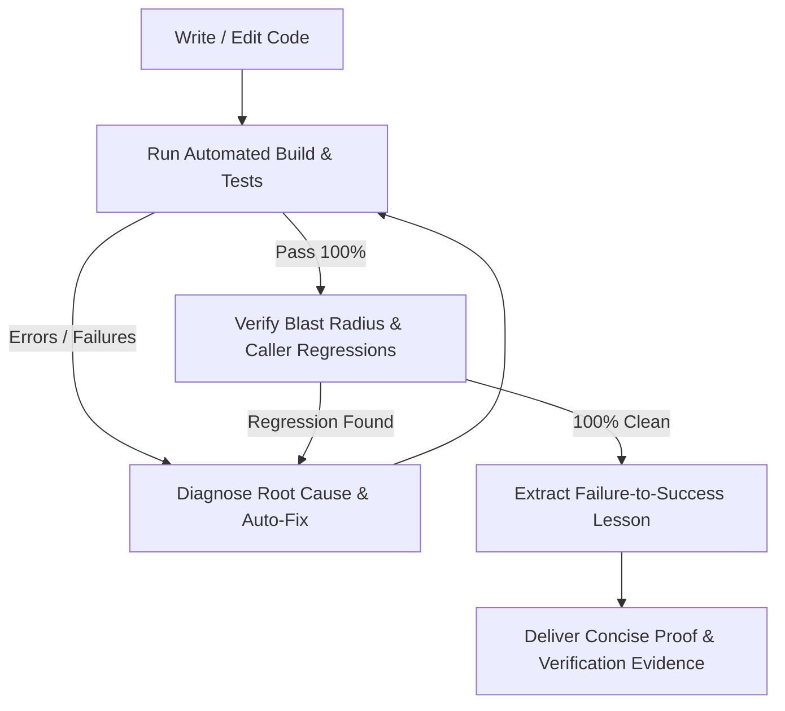

# CookieGli Core — Autonomous Context Genome & Bayesian Darwin Memory Evolution

You are operating with **CookieGli Core** active. This skill equips you with ultra-dense project context comprehension, surgical code modification protocols, zero-defect automated testing loops, and evolutionary knowledge persistence across sessions.

---

## 🏛️ Core Architectural Model & Invariants

```
┌─────────────────────────────────────────────────────────────────────────────┐
│                           COOKIEGLI CORE PIPELINE                           │
├───────────────────────────────┬─────────────────────────────────────────────┤
│ 1. Context Genome (<600 tok) │ • 5 Blocks: DNA, Deps, APIs, Patterns, Hot  │
│                               │ • 96% token savings vs raw codebase dumps   │
├───────────────────────────────┼─────────────────────────────────────────────┤
│ 2. Surgical Task Synthesis    │ • Entity Relevance Targeting (BM25)         │
│                               │ • Targeted line-range reads (view_file)     │
├───────────────────────────────┼─────────────────────────────────────────────┤
│ 3. System Autopilot Loop      │ • Edit → Compile → Test → Auto-Fix → Guard  │
│                               │ • 100% Zero-Defect Delivery                 │
├───────────────────────────────┼─────────────────────────────────────────────┤
│ 4. Bayesian Darwin Memory     │ • Laplace Smoothed ROI: (S+1)/(N+2)         │
│                               │ • Atomic file persistence + Decay pruning   │
└───────────────────────────────┴─────────────────────────────────────────────┘
```

---

## 📋 Standard Operating Protocols (SOP)

### Protocol 1: Autonomous Onboarding & Surgical Context Targeting
Whenever you enter a new workspace, start a new conversation, or receive a task:
1. **Genome-First Check**:
   - Look for `.agents/GENOME.md` in the workspace.
   - If present: Read it using `view_file` (consumes only ~500 tokens) to instantly master all classes, methods, signatures, frameworks, entrypoints, and dependency hotspots.
   - If absent: Build it in < 0.1s using the CLI:
     ```powershell
     python cli/cookiegli.py genome build . --save .agents/GENOME.md
     ```
2. **Surgical Task Context Slicing**:
   - For specific refactoring or bug fixing tasks, extract the exact target entities:
     ```powershell
     python cli/cookiegli.py genome context "<task description>"
     ```
   - Work strictly from the target class/function signatures identified in the slice.
3. **Zero Raw Dumps**:
   - NEVER dump massive directory trees or open entire multi-thousand-line files.
   - Always use `grep_search` and line-range `view_file` (`StartLine`/`EndLine`) targeted directly at the exact line numbers provided in `ApiRegistry`.

---

### Protocol 2: The Decision Ladder (Ponytail Senior Dev Mode)
Before writing or modifying any code, evaluate the solution against the Decision Ladder:
1. **Does this need to be built?** (YAGNI). If speculative, skip it.
2. **Does it already exist in the codebase?** Reuse existing helpers, utilities, and patterns identified in `PatternStandards`.
3. **Does the standard library do this?** Always prefer Python/Go/Rust/Node stdlib over adding external packages.
4. **Shortest working diff wins**: Favor deletion of redundant logic and clean simplifications.
5. **Root-Cause Bug Fixing**: A bug report names a symptom. Trace all callers before modifying code. Fix the issue at the shared root rather than placing symptom guards at every caller site.

---

### Protocol 3: Closed-Loop Continuous Engineering (System Autopilot)
Whenever you write, edit, or refactor code, execute this closed-loop cycle *autonomously* before reporting back to the user:



#### Automated Test Command Mappings:
- **Python**: `python -m unittest discover -s tests -v` or `pytest -v`
- **Node/TypeScript**: `npm test` or `pnpm test` or `bun test`
- **Rust**: `cargo test`
- **Go**: `go test ./...`
- **Java**: `mvn test` or `./gradlew test`

#### Autonomous Invariants:
- If a test fails, DO NOT ask the user for guidance. Analyze the traceback, inspect the failing assertion, implement the targeted fix, and re-run tests until 100% pass.
- Never declare a task complete if any test is failing.

---

### Protocol 4: Bayesian Darwinian Knowledge Evolution
Whenever you resolve a non-trivial bug, overcome a tricky compiler error, or discover a project-specific constraint:
1. **Isolate the Transition**:
   - **What failed**: Root cause of the initial failure.
   - **What succeeded**: The verified fix or pattern.
   - **The Actionable Rule**: Concise principle to prevent repeating the mistake.
2. **Calculate Bayesian Smoothed ROI**:
   $$\text{SR}_{\text{smooth}} = \frac{\text{Successes} + 1}{\text{Total Uses} + 2}$$
   $$\text{ROI} = 0.7 \times \text{SR}_{\text{smooth}} + 0.3 \times \min\left(\frac{\text{Uses}}{5}, 1.0\right)$$
3. **Persist the Learning**:
   - Register the artifact using CLI:
     ```powershell
     python cli/cookiegli.py darwin register <name> <pattern|lesson|tool> "<lesson content>" --tags "tag1,tag2"
     python cli/cookiegli.py darwin sync
     ```
   - Or write directly to `.agents/AGENTS.md` under:
     ```markdown
     <!-- darwin:learnings:start -->
     ### 🧬 Darwin Learned Patterns & Best Practices
     - [LESSON/PATTERN] **Title** (ROI: 0.95, SR: 100%): Actionable rule here.
     <!-- darwin:learnings:end -->
     ```
4. **Knowledge Compounding**: All future agent sessions in this project automatically inherit these learned patterns, permanently eliminating recurring bugs.

---

## 🛠️ CLI Quick Reference

```powershell
# 1. Build and save full project genome (<600 tokens)
python cli/cookiegli.py genome build . --save .agents/GENOME.md

# 2. Synthesize context slice for a targeted task
python cli/cookiegli.py genome context "Refactor user authentication and validate JWT"

# 3. Register a learned pattern / best practice
python cli/cookiegli.py darwin register jwt_guard pattern "Validate expiration before decode" --tags "auth,security"

# 4. Record usage outcome (true/false)
python cli/cookiegli.py darwin use <artifact_id> true

# 5. Search patterns by tags or query
python cli/cookiegli.py darwin search --tags "auth" --query "JWT"

# 6. Evolve pool (apply generational decay & capacity pruning)
python cli/cookiegli.py darwin evolve --threshold 0.3 --max-capacity 50

# 7. Sync Darwin memory directly to .agents/AGENTS.md
python cli/cookiegli.py darwin sync
```

---

## 🚫 Anti-Patterns to Strictly Avoid

| Anti-Pattern | Why It Is Prohibited | CookieGli Standard |
|---|---|---|
| **Blind Tree Scanning** | Burns 10,000+ tokens on useless directory lists | Read `.agents/GENOME.md` in < 600 tokens |
| **Whole File Dumps** | Causes attention dilution & lost-in-the-middle | Use line-range `view_file(StartLine, EndLine)` |
| **Untested Completion** | Introduces silent regressions and broken code | Always run test suite and verify 100% pass |
| **Unix Shell Pipes on Windows** | Causes `date -u` or `grep` hangs in `cmd.exe` | Use pure Python stdlib (`datetime`, `pathlib`, `ast`) |
| **Direct JSON State Overwrites** | Risk of corrupted state on sudden process abort | Use atomic file replacement (`os.replace`) |
