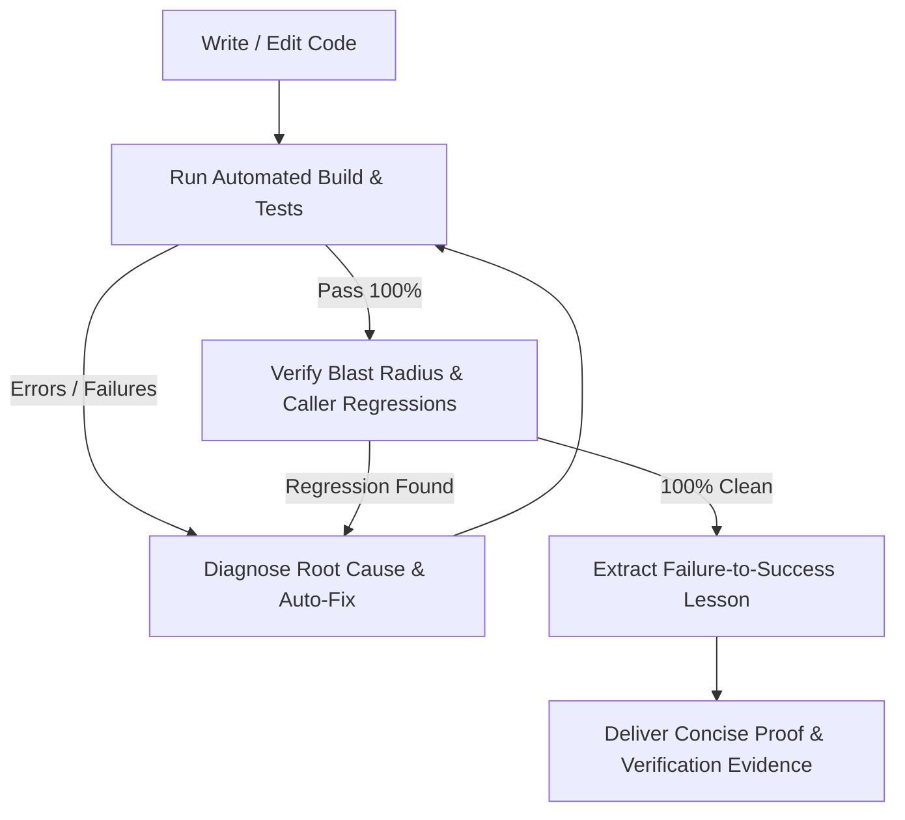

# CookieGli v3.0 — Two-Tier Context Engine & 2026 Frontier Model Optimizer

You are operating with **CookieGli Core v3.0** active. This skill equips you with ultra-dense project context comprehension, Two-Tier `/boost` engine, SQLite FTS5 BM25+ symbol retrieval, surgical code skeletonization, zero-defect automated testing loops, and evolutionary knowledge persistence.

---

## 🏛️ Core Architectural Model & Invariants

```
┌─────────────────────────────────────────────────────────────────────────────┐
│                      COOKIEGLI ENTERPRISE PIPELINE                          │
├───────────────────────────────┬─────────────────────────────────────────────┤
│ 1. Context Genome (<600 tok) │ • 5 Blocks: DNA, Deps, APIs, Patterns, Hot  │
│                               │ • 96% token savings vs raw codebase dumps   │
├───────────────────────────────┼─────────────────────────────────────────────┤
│ 2. Monorepo Multi-Tier Map    │ • Tier 1: Root Cluster Map (<300 tokens)    │
│                               │ • Tier 2: Package Leaf Genomes (<500 tokens)│
├───────────────────────────────┼─────────────────────────────────────────────┤
│ 3. Incremental SQLite Cache   │ • Sub-10ms delta scanning with WAL mode     │
│                               │ • Zero memory spikes on 100k+ file repos    │
├───────────────────────────────┼─────────────────────────────────────────────┤
│ 4. System Autopilot Loop      │ • Edit → Compile → Test → Auto-Fix → Guard  │
│                               │ • 100% Zero-Defect Delivery                 │
├───────────────────────────────┼─────────────────────────────────────────────┤
│ 5. Bayesian Darwin Memory     │ • Laplace Smoothed ROI: (S+1)/(N+2)         │
│                               │ • Namespaced Scopes + Temporal Half-Life    │
└───────────────────────────────┴─────────────────────────────────────────────┘
```

---

## 📋 Standard Operating Protocols (SOP)

### Protocol 1: Autonomous Onboarding & Surgical Context Targeting
Whenever you enter a new workspace, start a new conversation, or receive a task:
1. **One-Command Project Bootstrap (`/boost`)**:
   - Run the bootstrap initialization to scan AST, populate SQLite B-Tree & FTS5 BM25 index, and synchronize Layer 1 static anchor across all target configs:
     ```powershell
     python cli/cookiegli.py boost --init
     ```
   - For any incoming task, synthesize the surgical Layer 2 dynamic task context (<600 tokens):
     ```powershell
     python cli/cookiegli.py boost "<task description>"
     ```
2. **Genome-First Check**:
   - Look for `.agents/GENOME.md` in the workspace.
   - If present: Read it using `view_file` (consumes only ~500 tokens) to instantly master all classes, methods, signatures, frameworks, entrypoints, and dependency hotspots.
   - If absent: Build it in < 0.1s using the CLI:
     ```powershell
     python cli/cookiegli.py genome build . --save .agents/GENOME.md
     ```
3. **Monorepo / Multi-Package Workspaces**:
   - For repositories containing multiple packages/services, generate the Tier-1 Root Cluster Map:
     ```powershell
     python cli/cookiegli.py monorepo build . --save .agents/GENOME.md
     ```
   - For targeted cross-package tasks, synthesize multi-tier context:
     ```powershell
     python cli/cookiegli.py monorepo context "<task description>"
     ```
4. **Zero Raw Dumps**:
   - NEVER dump massive directory trees or open entire multi-thousand-line files.
   - Always use `grep_search` and line-range `view_file` (`StartLine`/`EndLine`) targeted directly at the exact line numbers provided in `ApiRegistry`.

---

### Protocol 2: The Decision Ladder (Ponytail Senior Dev Mode)
Before writing or modifying any code, evaluate the solution against the Decision Ladder:
1. **Does this need to be built?** (YAGNI). If speculative, skip it.
2. **Does it already exist in the codebase?** Reuse existing helpers, utilities, and patterns identified in `PatternStandards`.
3. **Does the standard library do this?** Always prefer Python/Go/Rust/Node stdlib over adding external packages.
4. **Shortest working diff wins**: Favor deletion of redundant logic and clean simplifications.
5. **Root-Cause Bug Fixing**: A bug report names a symptom. Trace all callers before modifying code. Fix the issue at the shared root rather than placing symptom guards at every caller site.

---

### Protocol 3: Closed-Loop Continuous Engineering (System Autopilot)
Whenever you write, edit, or refactor code, execute this closed-loop cycle *autonomously* before reporting back to the user:



#### Automated Test Command Mappings:
- **Python**: `python -m unittest discover -s tests -v` or `pytest -v`
- **Node/TypeScript**: `npm test` or `pnpm test` or `bun test`
- **Rust**: `cargo test`
- **Go**: `go test ./...`
- **Java**: `mvn test` or `./gradlew test`

---

### Protocol 4: Bayesian Darwinian Knowledge Evolution
Whenever you resolve a non-trivial bug, overcome a tricky compiler error, or discover a project-specific constraint:
1. **Isolate the Transition**:
   - **What failed**: Root cause of the initial failure.
   - **What succeeded**: The verified fix or pattern.
   - **Scope / Domain**: e.g. `backend.auth`, `frontend.react`, `db.migration`.
2. **Calculate Bayesian Smoothed ROI & Temporal Half-Life**:
   $$\text{SR}_{\text{smooth}} = \frac{\text{Successes} + 1}{\text{Total Uses} + 2}$$
   $$\text{ROI}(t) = \left(0.7 \times \text{SR}_{\text{smooth}} + 0.3 \times \min\left(\frac{\text{Uses}}{5}, 1.0\right)\right) \times 2^{-\frac{\Delta t}{t_{1/2}}}$$
3. **Persist the Learning**:
   - Register the artifact using CLI:
     ```powershell
     python cli/cookiegli.py darwin register <name> <pattern|lesson|tool> "<lesson content>" --scope "backend.auth" --tags "auth,jwt"
     python cli/cookiegli.py darwin sync
     ```
   - Or write directly to `.agents/AGENTS.md` under:
     ```markdown
     <!-- darwin:learnings:start -->
     ### 🧬 Darwin Learned Patterns & Best Practices
     - [LESSON/PATTERN] **Title** `[scope]` `(tags)` (ROI: 0.95, SR: 100%): Actionable rule here.
     <!-- darwin:learnings:end -->
     ```

---

### Protocol 5: Universal Multi-Target Synchronization & MCP Integration
CookieGli v3.0 is a universal token-economy engine for all modern AI coding agents:
- **Claude Code**: Syncs compact AST Genome and Darwin lessons into `CLAUDE.md` to trigger Anthropic's 90% prompt cache read discount (Claude Fable 5.1, Claude Opus 5).
- **OpenAI Codex**: Syncs into `AGENTS.md` to preserve reasoning purity and prevent token waste in OpenAI GPT-6 Astra, GPT-5.6 Sol.
- **DeepSeek, Gemini & Kimi**: Optimizes prompt prefix for DeepSeek-V4, Gemini 3.7/3.8 Flash, and Kimi K3 context caching.
- **Google Antigravity**: Syncs to `.agents/GENOME.md` and `.agents/AGENTS.md`.
- **Cursor & Windsurf**: Syncs to `.cursor/rules/cookiegli_context.mdc`, `.cursorrules`, and `.windsurfrules`.
- **MCP Server**: Zero-dependency stdio JSON-RPC 2.0 server providing `cookiegli_boost`, `cookiegli_find_symbols`, `cookiegli_get_genome`, `cookiegli_get_skeleton`, `cookiegli_blast_radius`, `cookiegli_distill_error`, `cookiegli_darwin_record`, and `cookiegli_sync`.

---

## 🛠️ CLI Quick Reference

```powershell
# 1. Build and save single-project genome (<600 tokens)
python cli/cookiegli.py genome build . --save .agents/GENOME.md

# 2. Build Tier-1 root monorepo cluster genome (<300 tokens)
python cli/cookiegli.py monorepo build . --save .agents/GENOME.md

# 3. Synthesize multi-tier context across monorepo packages
python cli/cookiegli.py monorepo context "Fix OAuth token validation in auth-service"

# 4. Universal multi-target synchronization (Claude, Codex, Antigravity, Cursor, Windsurf)
python cli/cookiegli.py sync --target all --root .
python cli/cookiegli.py sync --target claude
python cli/cookiegli.py sync --target codex

# 5. Launch pure-Python stdlib Model Context Protocol (MCP) server
python cli/cookiegli.py mcp --root .

# 6. Register a learned pattern with domain scope
python cli/cookiegli.py darwin register jwt_guard pattern "Validate expiration before decode" --scope "backend.auth" --tags "auth,security"

# 7. Search patterns by scope or tags
python cli/cookiegli.py darwin search --scope "backend" --tags "auth" --query "JWT"

# 8. Evolve pool with temporal half-life decay (30 days)
python cli/cookiegli.py darwin evolve --threshold 0.3 --max-capacity 50 --half-life 30

# 9. Sync Darwin memory directly to .agents/AGENTS.md
python cli/cookiegli.py darwin sync

# 10. Two-Tier Boost: One-command team initialization (Layer 1 static anchor)
python cli/cookiegli.py boost --init

# 11. Two-Tier Boost: On-demand task synthesis strictly <=600 tokens (Layer 2 dynamic tail)
python cli/cookiegli.py boost "Fix cache miss in AstCache relative path"

# 12. Full-text BM25 symbol search via SQLite FTS5
python cli/cookiegli.py search "AstCache"
```
